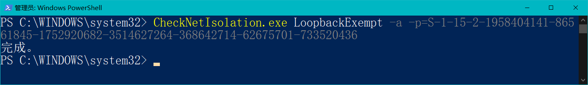

# 2. 安装和使用

## 0. 阅读并同意免责声明

作为用户，你首先需要明确：**使用trapdoor带来的功能就意味着承担第三方软件带来的风险。**为了不给开发者带来不必要的麻烦，请阅读如下的免责声明，如果**你使用了trapdoor就意味着你自动同意了该声明**。


```txt
免责声明

trapdoor(以下简称tr)是一个利用dll远程注入技术开发的BDS辅助软（插）件，它提供了不少方便玩家的功能，给生电玩家创造了便利。此外，tr本身是开源免费的，内部没有任何恶意代码，原则上也不会对存档造成任何损害。

但是考虑到此类软件的特殊性，开发者无法完全保证tr对用户的存档不造成任何破坏，万一发生意外情况，开发者不会也没有能力对tr对用户
造成的损失负责。

如果你继续使用tr插件，那么就代表你同意了该声明(或者说叫用户协议)，如果你不想承担此类风险，请停止使用tr插件。

附录： 以下是一些使用建议:
- 及时更新插件到新版本，因为目前tr还是beta版，理论上越更新bug肯会越少
- 尽量关闭不用的功能
- 及时备份存档永远是好习惯
2022.1.11
```

## 1. 下载BDS

插件是依托于BDS的，因此使用trapdoor之前需要下载BDS。前往[https://www.minecraft.net/en-us/download/server/bedrock](https://www.minecraft.net/en-us/download/server/bedrock)下载**正确版本**的Windows版的BDS文件，并解压到任意文件夹。
:::warning
**文件夹路径中不建议包含中文字符。**
:::

## 2. 开启Loop back

UWP应用默认关闭了loop back（默认情况下UWP应用无法连接localhost）,你需要开启才能连接本地服务器，**如果是云服务器的多人游戏可以省去这一步**。以管理员权限打开`powershell`,并运行如下命令(该命令来自微软官网):

```powershell
CheckNetIsolation.exe LoopbackExempt -a -p=S-1-15-2-1958404141-86561845-1752920682-3514627264-368642714-62675701-733520436
```

如果该步骤顺利的话`powershell`会输出"完成"二字，如下图所示：


## 3. 安装LiteLoaderBDS

参考[LiteLoaderBDS中文安装教程](https://github.com/LiteLDev/LiteLoaderBDS#for-windows)安装服务器对应版本的LiteLoaderBDS。**如遇到LiteloaderBDS相关的问题请前往[这里](https://github.com/LiteLDev/LiteLoaderBDS/issues)这里进行反馈。而不是找本插件开发者**。

## 4. 下载并安装插件本体

1. 前往[Trapdoor的下载页面](https://github.com/hhhxiao/trapdoor-ll/releases)下载发布的release文件
2. **解压下载到的压缩包，把所有文件复制到BDS的根目录即可**这时候相关配置文件的路径如下所示：

```
└───bedrock-server-xxx
  └───plugins
  	└───trapdoor-xx-xx.dll
    └───trapdoor
         └───config.json
```

在较新的版本中release内会内置`installer.exe`你可以在解压后直接双击该可执行程序，选中BDS根目录并点击安装即可。

## 5. 配置配置文件

创造服一般可用不配置，生存服可能需要根据需求关闭部分功能(如`tick`，漏斗计数器等)。具体配置参考[配置文件](/4.config)一节。


## 6. 加载材质包
下载纹理包，然后客户端加载该纹理包即可(**不是服务端，是每个玩家都要在本地加载，和普通材质包一样使用**)，加载好的游戏截图如下所示：

由于本插件的资源包系统修改过多次，因此不同的版本会有不同的资源表需求，具体见下表：

| 版本        | 资源包下载                                                   |
| ----------- | ------------------------------------------------------------ |
| beta ~ 0.18 | [Trapdoor CUI v0.4](https://github.com/OEOTYAN/Trapdoor-CUI/releases/tag/v0.4) |
| 0.19 ~ 0.25 | [Trapdoor CUI v5.0](https://github.com/OEOTYAN/Trapdoor-CUI/releases/tag/v5.0) + [LiteLoaderBDS CUI 1.0](https://github.com/OEOTYAN/LiteLoaderBDS-CUI/releases/tag/ll.1.0) |
| 0.26 +      | [LiteLoaderBDS CUI 1.1](https://github.com/OEOTYAN/LiteLoaderBDS-CUI/releases/tag/v1.1) |


## 7. 连接服务器进入游戏

如果你是本地开服,IP填写`127.0.0.1`或者`localhost`，如果你用的是云服务器而不是本地，填公网IP即可(不知道的问你们服务器的服主)。端口按照自己的设置在服务器的配置文件里面改，默认`19132`。
