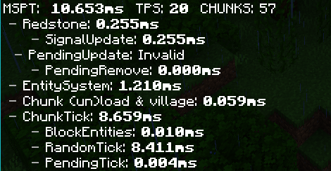

# 功能介绍

## 说明

在以下的所有指令说明中，
- `<>`表示必填参数
- `<int>`表示整形数据，如`-1,1,0,12,128`等等
- `<bool>`表示布尔型数据，只能填`true`(或者`1`)和`false`(或者`0`)
- `<str>`表示字符串数据，可以填任意字符串，如`hhhxiao`,`mojang`等等。

此外，所有命令都可以使用`?`子命令用以显示帮助，如：
```shell
tick ?
```
会显示 `tick`的所有子命令的含义及其用法。

## 指令

### td?
该命令用于显示**当前用户能够执行的**所有指令的帮助，无子命令，如果**命令过少可能是被腐竹关闭或者你权限不够**。

### apicfg

该指令用于插件API的部分参数配置，目前有以下两个子选项
- `apicfg pvd <int>`   配置图形的可视距离，这里的图形指的是插件的所有的可视化效果，包括村庄显示,区块边界显示，结构刷怪点显示和史莱姆区块显示等粒子。

:::tip
在生成粒子时插件会检测同维度下离距离生成点最近的玩家和其的距离，如果距离超过这个设定值插件就不会生成该粒子。
:::

- `apicfg pm <bool>`  是否开启性能模式，开启后可视化造成的游戏卡顿会减少一半，但是显示效果会稍微差点，默认关闭  

:::tip  
对应每条直线插件都会生成两个粒子(45度和-45度方向)，开启此选项插件就只会生成一个。
:::

### tick

- `tick fz` 暂停游戏运行
- `tick slow <int>`  放慢游戏运行速度，执行该命令后，`1gt = 50 * num ms`，`num`在`[2,64]`之间
- `tick acc <int>` 加快游戏运行速度，执行该命令后，`1gt = 50/num ms`,当然具体效果还是依赖服务器的硬件性能，num必须在[2,10]之间（如果你觉得上限10太小了可以去github页面反馈。）
- `tick fw <int>` 让游戏瞬间快进`num` gt,瞬间指的多长现实时间仍旧依赖的服务器的性能，`num`过大会导致游戏长时间无响应，是正常现象，请耐心等待
- `tick r` 恢复所有的加速减速或者暂停状态到正常
- `tick q` 查询服务器的加速或者减速状态，该指令会向游戏屏幕输出一个字符串,不会对游戏运行产生任何影响

1. 在大量执行`tick`相关指令后可能会因为玩家和服务器的时钟不同步问题而导致玩家无法进入游戏，这个问题暂时无法用插件解决，只能通过重启服务器来解决问题；
2. 在使用`tick acc`时请勿把倍数设为过大，除非你的电脑性能足够好。建议先使用`prof`指令测一下`mspt`然后用$\frac{50}{mspt}$向下取整后的整数作为最大倍数。

:::tip
MCBE的游戏主逻辑运行在一个单独的线程中，这个线程每隔50ms执行一次`ServerLevel::tick()`函数，函数内部会执行区块更新，村庄更新，红石更新等等内容。因此把50ms成为一个游戏刻(game tick)，简称`gt`。`tick`命令的原理就是更改这个函数的执行频率。
:::

### mspt

该指令会显示当前游戏的`mspt`和`TPS`,且**只计算`1gt`的数据**。

由于游戏在红石刻要做的任务比非红石刻多得多，且红石刻和非红石刻是间隔运行的，因此`mspt`显示的数据波动很大属于正常现象，很大说明测到了红石刻的用时，很小就说明测到了非红石刻的用时。如果你想较为准确地评估当前的`mspt`，可以简单地取平均值，也可直接使用`prof`指令。

在新版的`mspt`中输出的第一个字符`#`如果是红色就说明遇到了红石刻，白色说明是普通刻。

:::tip
mspt指的是`ServerLevel::tick`的运行时间，由于这个函数理论上50ms执行一次，那么如果mspt的大于50，下一个游戏刻的执行时间会被延迟，这就叫**掉刻**，因此服务器需要极力避免这种情况的发生。
:::

### prof

- `prof` 计算并展示游戏游戏运行的各项用时，取`100gt`的平均值，因此会间隔`5s`才返回结果,该指令的输出会广播到所有玩家。下图展示了该指令的一个输出：

  

  第一行展示平均MSPT、TPS以及每gt加载的区块数，后面按照类别分为四大项，每一项后面又有一些小项：

  - `Redstone` 表示红石相关的卡顿分析
    - `SingalUpdate` 表示红石信号更新时间（静态电路卡顿）
    - `PendingUpdate, PendingRemove`表示红石电路更新时间 (动态电路卡顿)
  - `EntitySystem`表示实体系统的更新时间（和实体更新区别开）
  - `Chunk (un)load & village` 区块加载和村庄更新等花的时间
  - `ChunkTick` 区块更新所需的时间
    - `BlockEntities`方块实体更新时间
    - `RandomTick` 随机刻更新时间
    - `PendingTick` 计划刻更新时间

  此外该命令没有打印实体更新所用的时间，因为这一项在`prof actor`命令中被单独给出。

  ```c++
  MSPT = Redstone + EntitySystem + Chunk(un)load + ChunkTick + ActorTick + Others
  ```

- `prof actor` 计算并展示游戏运行时的各种实体的详细计算用时，也能显示当前加载区域内的各种实体的数量，取`100gt`的平均值,每一行第一个是实体名字，英文显示，后面是更新总时间，**括号内是更新区块内的实体数量**。如果你发现某个实体的数量显示的是0，可能是它在测试一半被despawn或者被杀了,插件计算个数用的算法是使用更新次数/100来表示实体数量。

- `prof c <int>` 和`prof`的功能相同，但是后面需要接一个整数以自定义测量时间,`prof`和`prof c 100`完全等价
- `prof chunk` 列出区块加载的时间，并打印前10个更新时间最长的区块的中心的**世界坐标**
- `prof pt` 列出区块内计划刻队列缓存的长度，只展示前10个缓存最大的区块的中心的**世界坐标**

### func

该指令是启用和关闭全局功能的各种功能的开关，所有玩家公用这一个开关，建议设定为仅管理员可用。
- `func rotate <bool>` 开启或者关闭仙人掌转方块，默认关闭
- `func hopper <bool>` 开启或者关闭漏斗计数器，默认关闭
- `func spawn <bool>` 开启或者关闭刷怪概率分析，默认关闭
- `func expl <bool>` 开启或者关闭爆炸破坏地形(开启后会对实体造成影响但是不影响地形)，默认关闭
- `func ncud <bool>` 开启或者关闭NC更新，默认关闭


### village
该指令是村庄机制的相关指令
- `village list`列出所有**正在加载**的村庄,数据每`20gt`更新一次`

- `village b <bool>` 开启或者关闭村庄边界显示，游戏中显示为红色矩形框

- `village c <bool>` 开启或者关闭村庄中心显示，游戏中显示为爱心粒子

- `village s <bool>` 开启或者关闭铁傀儡刷出区域显示，游戏中显示为蓝色矩形框(如果你发现此区域不准确请联系开发者进行调整)

- `village p <bool>` 开启或者关闭POI查询范围显示，游戏中显示为红色矩形框

- `village v <bool>` 开启或者关闭居民信息显示:开启后村民头顶会出现`B M J` 这三个字母，分别表示床，集会点(钟)以及工作方块，红色表示未绑定，绿色表示已经绑定好了。攻击村民可以显示它所属的村庄中心以及绑定的POI具体坐标(开启该功能后玩家对村民的攻击无效，不会对游戏造成任何影响)，攻击铁傀儡会显示它所属的村庄中心(也不会对铁傀儡造成任何伤害)

  在新版(1.17.10.04+)的插件中对该指令做出了调整，村民头上的信息类似`[1] 2 ☾ ⍾ ☕ 12`这样，第一个`[1]`表示村民所属的村庄序号，第二个`2`是该村民的村庄内序号，如果该值为1，那么该村民绑定的第一个POI即为村庄中心的默认位置，最后一个数字12表示村民的内部时钟，正常情况下该值在0到90之间。中间的`☾ ⍾ ☕`三个符号分别表示该村民的床，钟，工作方块的绑定情况，**绿色为已绑定，红色为未绑定**，且该版本**取消了攻击村民无伤害这一特定，当然也取消了显示POI坐标的功能**。

- `village n`列出离命令发送者最近(以村庄中心和玩家的距离为准)的村庄的详细信息，包括所有POI的具体坐标和绑定关系 。

三种框的颜色和村庄中心的粒子效果在配置文件中可以设置，详见配置文件一节。

### hsa

- `hsa show <bool>`开启或者关闭结构中的定点刷怪区域(HSA)显示,绿框为地狱堡垒，红框为女巫小屋，黄框为海底神殿，蓝框为掠夺者前哨站

- `hsa clear` 清除HSA的数据缓存并打印清除的HSA数目

:::tip
如果HSA个数过多会造成客户端的渲染卡顿（就是帧率降低），这时候你可与通过`apicfg`命令来调整例子效果以减小卡顿。
:::
- `hsa draw` 在所有HSA上放置玩家脚底的方块（只有开启`func draw true`）后方可使用该功能

#### slime

- `slime show <bool>` 开启或者关闭史莱姆区块显示

:::tip
史莱姆区块的显示例子每`5s`更新一次，因此你在关闭显示后再过几秒后显示效果才会完全消失。
:::
- `slime c`清空并重新计算史莱姆区块缓存

- `slime r <int>` 设置史莱姆区块的显示的半径`r`

  插件只会计算以玩家所在区块为中心的`(2r+1)*(2r+1)`的正方形区域中的所有史莱姆区块

### o,s,c
游戏自带指令`gamemode` 的扩展
- `o` 切换当前玩家为创造观察者模式(**1.17+该指令失效**)
- `s` 切换当前玩家为生存模式
- `c` 切换当前玩家为创造模式

### os

该命令用于显示服务器相关信息，第一行是当前进程的CPU占用，第二行是当当前进程的内存占用。如下图所示：
```
CPU : 12%
Mem: 170MB VMem 171MB
```

### self

该命令是玩家个人信息的显示，不会影响其它玩家

- `self`显示一些信息，包括区块坐标，视角，维度等等
- `self chunk <bool>`开启关闭自己的区块显示
- `self me <bool>` 开启或关闭测量功能
- `self rs <bool>` 开启或者关闭信号源查看功能

### backup

该指令提供备份相关功能,在使用该指令之前需要到配置文件中填写存档名字.

- `backup b`备份当前存档
- `backup l`列出所有的备份

:::tip
所有备份的存档都没有被压缩，而是直接被移动到`./plugins/trapdoor/backup`目录中，由于读写冲突，备份有概率失败是正常现象。
:::

### draw

该功能需要`func draw true`后才可使用

该功能弥补了原版的`fill`只能画长方体的不足，增加了画圆、球和区块填充的功能

所有子命令都是以玩家脚下站的方块为填充方块

- `draw ci <int>`,建造半径为`abs(num)`的圆形，输入为正数时建造实心的，输入为负数时建造空心的
- `draw sp <int>` 建造对应半径的球体，其它同上一条指令
- `draw ch` 用脚下方块填充玩家所属的区块(只填一层,也就是16\*1\*16的区域)

> 这个 功能面对栅栏，石墙等高1.5格的方块没法使用

### counter

该功能需要`func hopper true`后方可使用

漏斗计数器是用来统计物品流量的功能。

在你用`/func hc true`后，如果漏斗对准的不是箱子而是16色的混凝土，那么漏斗就会变成无尽漏斗，所有吸入的东西都不会放入漏斗的物品槽中，但是数据会保留下来。你可以用`/counter p channel`来查看这些漏斗吸收的物品数据,包括每种物品的个数和吸入平均速率。用`/counter reset channel`来重置某个频道的所有漏斗。`channel`选填`[0-15]`,对应16色的混凝土，如果你记不清哪个颜色对应哪个特殊值，**使用仙人掌右键某个颜色的混凝土方块可以直接显示该频道的数据**。

### fakeplayer

:::warning
该功能bug有点多，不建议过度依赖
:::

 trapdoor本身**并不提供**假人玩家的功能，该指令提供了和[假人插件](https://github.com/ddf8196/FakePlayer)联动的功能，开启假人插件的websocket,就能利用trapdoor与其进行交互，在游戏内部操作假人
- `fakeplayer conn <str>`连接假人插件，`str`是websocket链接，如`ws://127.0.0.1:1234`
- `fakeplayer add <str>`添加假人到出生点
- `fakeplayer remove <str>`移除假人
- `fakeplayer list <str>` 列出所有
- `fakeplayer tp <str>` 传送假人到当前玩家所在位置

## 功能
下面是一些非指令的功能
### 仙人掌转方块

该功能需要`func rotate true`后方可使用
仙人掌右击部分方块可以旋转该方块,也就是改变方块的特殊值，支持所有的半砖，楼梯以及红石原件等方块。

### 区块显示

该功能需要`self chunk true`后方可使用

开启后就是区块显示，普通区块为白色网格，史莱姆区块为绿色网格(主要是为了弥补1.16.4以后的区块边界材质包失效的问题)

### 刷怪指示器

该功能需要`func spawn true`后方可使用

- 骨头右击方块可以可视化纵轴的刷怪选点过程

- 火药右键方块可以显示亮度为0时候的刷怪类型概率(主要是敌对生物)

- 皮革右键方块可以显示亮度为15时候的刷怪类型概率(主要是有好生物)

(这么做主要还是获取亮度的API有问题)

:::tip
显示的概率不是理论值，而是插件测试上千次后的统计数据，因此每次显示的数据略有不同是正常现象
:::

### 测量

该功能需要`self me true`后方可使用

使用木剑右击方块设置一个点，使用石剑右击方块设置第二个点，输出第一行是两个点的坐标，后面跟着两行两列四个数据：第一行是不忽略y的空间，第二行是忽略y的平面距离；第一列是利用勾股定理计算的欧氏距离，第二列是曼哈段距离。

### 信号源查看
:::warning
1.17后该功能被移除
:::

该功能需要`self rs true`后方可使用
使用木棍右击红石原件即可，屏幕会输出该原件的红石信号的值(这个值对中继器比较器来说是无效数据)，下面几行是这个原件的信号源坐标以及其红石信号值，同时在游戏内也会在信号源的头顶生成白色烟雾粒子。